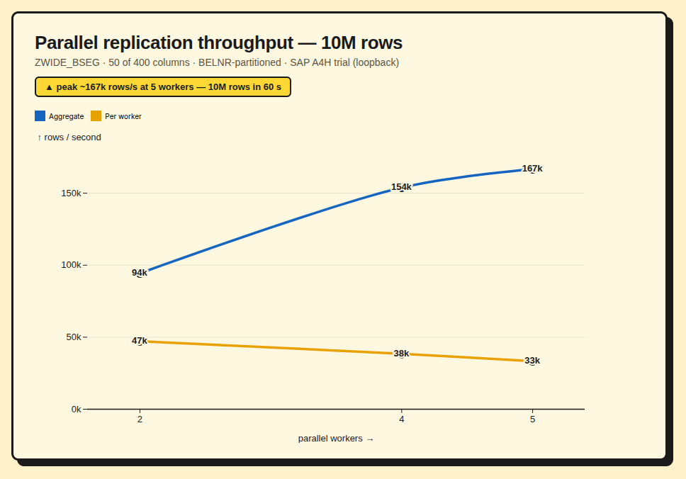

# erpl-rev — push SAP data into DuckDB, parquet, and live SQL

**erpl-rev lets ABAP move SAP data straight into [DuckDB](https://duckdb.org).**
It is a standalone C++ server that registers at the SAP gateway as an RFC
destination and hosts function modules your ABAP code calls with
`CALL FUNCTION '…' DESTINATION 'ERPL_REV'` — with DuckDB running behind them.
There is **nothing to install inside SAP** (no DuckDB extension) and **no DDIC
structures to define**: payloads travel as plain JSON over RFC, so any table,
CDS view, or query result flows through the same generic interface.

It is the inverse of [`erpl`](https://github.com/DataZooDE/erpl) — where `erpl`
makes DuckDB call *into* SAP, **erpl-rev has SAP call out into DuckDB.**

> Status: research prototype. The core paths — replicating table / CDS / BW
> sources, publishing to parquet, datasets and attached catalogs, querying and
> live serving — are verified end-to-end against a live SAP ABAP (A4H) system in
> `scripts/e2e.sh`. The wider lakehouse targets (Iceberg, DuckLake, cloud object
> storage, other attached warehouses) ride the **same DuckDB SQL path**, so they
> work wherever DuckDB's extensions do.

## Use cases

erpl-rev turns the SAP gateway into a two-way door between ABAP and the whole
DuckDB ecosystem — **read** SAP out into the lakehouse, and **write** the wider
data world back in through ABAP.

### Read — get SAP data out, at scale

- **Replicate any SAP source into DuckDB.** Transparent **tables**, **CDS views**,
  and **BW / HANA calculation views** (read natively over ADBC) all flow through
  the same path into a typed DuckDB table — full or filtered, with a source-side
  `WHERE`, column selection, and idempotent `UPSERT`. Built for full loads up to
  **>100M rows** with parallel workers (see [Performance](#performance)).
  → [Replicating SAP tables](#replicating-sap-tables-slt-style)
- **Build a SAP-sourced lakehouse.** Land a SAP slice straight into open table
  formats — **parquet** files and partitioned datasets, **DuckLake**, or
  **Iceberg** — on local disk or **cloud object storage** (S3 / GCS / Azure, via
  DuckDB's `httpfs`). Other engines (Spark, Trino, Snowflake, …) read it from
  there; SAP stops being a silo.
- **Publish into an existing warehouse.** `ATTACH` a **Postgres**, **MySQL**,
  **BigQuery**, **DuckLake**, or **Iceberg** catalog and push the SAP slice into
  it with a single SQL statement — replication / reverse-ETL without a separate
  tool.
- **Feed BI & data science.** The output is plain parquet/Arrow — open it in
  pandas, Polars, or any notebook — or query the live server (below) directly.

### Write — bring the world back into SAP

- **Enrich SAP data with external data.** DuckDB reads a parquet / Iceberg /
  DuckLake dataset (or an attached Postgres / BigQuery table) **from the cloud**,
  joins it against SAP data, and hands the joined result back to ABAP as rows —
  cross-system joins SAP can't do on its own.
- **Reverse-ETL reference data into SAP.** Pull a curated dataset from the
  lakehouse through DuckDB and return it to ABAP, which persists it into your
  SAP tables — keep SAP aligned with an external source of truth.
- **Interactive SQL console in ABAP.** `Z_ERPL_REV_SQL` (`SE38`) runs arbitrary
  DuckDB SQL — over SAP data, cloud files, or attached catalogs — from the SAP
  GUI, with results in an ALV grid.

### Serve — live, no export step

- **Expose ingested data to remote DuckDB clients.** With `--quack`, the same
  in-process DuckDB is reachable over the network, so whatever ABAP just ingested
  is instantly queryable (and `ATTACH`-able) from any DuckDB client.
  → [Quack network server](#quack-network-server)

## Built for the SAP data stack

What SAP teams tend to ask about — and why erpl-rev fits:

- **No SLT, no SDI, no Data Services, no add-on.** It's a registered RFC server
  plus a small function group (`ZERPL_REV`) and one report — shipped as a
  transport, not a kernel patch, an HANA license, or a BTP subscription. Works
  against any NetWeaver ABAP stack (ECC, S/4HANA, BW/4HANA); the only SAP-side
  prerequisite is a type-T RFC destination and gateway registration.
- **Reads the sources you actually model.** Transparent **tables**, **CDS views**
  (incl. `WITH PARAMETERS`, keys auto-detected), and **BW / HANA calculation
  views** (read natively over ADBC, e.g. `"_SYS_BIC"."pkg/CV"`) — all through one
  path, with their semantics intact rather than as raw tables.
- **SLT semantics you already know (LTRS).** Field selection / target
  minimization, a **source-side `WHERE`** so non-matching rows never leave the
  SAP system, and a key-based **`UPSERT`** that dedups on re-run — the three
  per-table knobs of SLT, without standing up SLT.
- **DDIC-typed and provably faithful.** NUMC / DATS / TIMS / CURR / QUAN /
  `DECIMAL` precision+scale / RAW map to real DuckDB types, and Open SQL reads are
  **client-aware** (MANDT-scoped). A built-in diff harness checks the target
  against the source **cell-by-cell** (SFLIGHT, REPOSRC, and a 400-column
  BSEG-shaped table) — fidelity you can demonstrate, not assume.
- **DuckDB analytics on SAP data — and past it.** Send arbitrary SQL and get a
  typed result back in ABAP, or an ALV grid via the **in-GUI SQL console**
  (`Z_ERPL_REV_SQL`, `SE38`): joins, window functions and aggregations that are
  painful in Open SQL. Then **federate** — join a SAP slice against an Iceberg /
  DuckLake / parquet dataset or an attached Postgres / BigQuery table **in one
  statement**, which the SAP stack can't do on its own.
- **It eats the scary tables.** A 400-column **BSEG**-shaped line-item table at
  **10,000,000 rows in ~60 s** (see [Performance](#performance)) — wide, deep,
  fully typed.

## Performance



Built for full loads of arbitrary size — fast, parallel, memory-bounded, and
restartable:

- **Parallel full loads — measured.** Each worker streams a disjoint key range
  and ingests it with a DuckDB **`Appender`** + one vectorized `INSERT … SELECT`;
  N workers run concurrently into one target and the primary key is built once at
  the end. Replicating a **50-column slice of a 400-column BSEG-shaped table —
  all 10,000,000 rows** — on the SAP A4H developer trial, partitioned on the
  document-number key, over loopback:

  | Workers | Wall time | Aggregate | Per worker |
  |:-------:|----------:|----------:|-----------:|
  | 2 | 106 s | ~94,000 rows/s  | ~47,000 rows/s |
  | 4 |  65 s | ~154,000 rows/s | ~38,000 rows/s |
  | 5 |  60 s | ~167,000 rows/s | ~33,000 rows/s |

  **Peak ~167,000 rows/s at 5 workers — 10M rows in a minute.** Aggregate keeps
  climbing as you add workers (here up to the trial's 5 batch work processes);
  scaling is sublinear because workers contend for the SAP read side and the
  shared server ingest, so per-worker throughput tapers (47k → 33k). Throughput
  tracks table width — the full 400-column row sustains ≈5,500 rows/s per
  stream — and the `Appender` path is ~230× the naive per-row baseline
  (`test/bench_ingest.cpp`).
- **Memory bounded by batch, not table size.** Each worker reads **package-wise**
  (keyset pagination, default 50,000 rows/batch); only one package is resident at
  a time, so a 100M-row load uses the same RAM as a 100k-row one.
- **Restartable & idempotent.** Full-load-replace truncates up front and keyed
  `UPSERT` dedups on conflict, so a crashed or re-run load yields no duplicates;
  a file-backed DuckDB keeps ingested data durable across server restarts.
- **Parallel via background jobs.** Workers run as SAP background jobs
  (`Z_ERPL_REV_REPL_WORKER`), so a load isn't bound by the dialog step timeout and
  uses spare batch work processes; the coordinator auto-picks a partition column
  and a sensible job count.
- **Byte-identity verified.** A diff harness compares the DuckDB target against
  the SAP source cell-by-cell (SFLIGHT every row × column; ZWIDE_BSEG 3000 × 390
  via per-row md5), plus a negative control — see
  [Very large tables](#very-large-tables-100m-rows).

## Architecture

```
ABAP  ──CALL FUNCTION 'Z_DUCKDB_QUERY' / 'Z_DUCKDB_INGEST' DESTINATION 'ERPL_REV'──►
   SAP gateway (registered-server routing, RFCOPTIONS H=RFCSERVER)
      └──► erpl_rev_server (C++)  ──►  DuckDbBridge  ──►  DuckDB (parquet/json)
```

- **Server model**: automatic (`RfcCreateServer`/`RfcLaunchServer`); hard-coded
  FM metadata (`RfcCreateFunctionDesc`/`RfcAddParameter`) mirroring the ABAP
  interfaces. The C callback signature is bridged to C++ via `extern "C"` shims.
- **Payloads are JSON strings** over scalar `STRING` RFC params — schema-generic,
  no custom DDIC structures needed. Query returns `EV_COLUMNS` (JSON name/type),
  `EV_ROWS` (JSON array of row objects), `EV_ROW_COUNT`, `EV_ERROR`. Ingest takes
  `IV_TARGET/IV_MODE/IV_KEYS/IV_PARQUET_OUT/IV_DATA` → `EV_ROWS_AFFECTED`,
  `EV_ERROR`. The data FMs report problems via `EV_ERROR` (returning `RFC_OK`),
  so ABAP gets a clean error string rather than a SYSTEM_FAILURE exception.
- **DuckDB**: links the official prebuilt `libduckdb.so` (**v1.5.3**; parquet +
  json built in), fetched by `make duckdb-dist` into `vendor/`. v1.5.3 is the
  first release with the **quack** extension, and the official build matches the
  public extension repo so `INSTALL quack` resolves at runtime. (Override with
  `-DDUCKDB_DIST=<dir>`, or fall back to erpl's vendored build by leaving it
  unset.) DuckDB's JSON *table functions* aren't auto-loaded here, so rows are
  parsed in C++ (`json_util`) and emitted as SQL literals.
- **Static where possible**: our code + libstdc++/libgcc are static; the only
  dynamic deps are `libduckdb.so` and the SAP NW RFC `.so` trio
  (`libsapnwrfc`/`libsapucum`/`libicu*.so.50`) — none ship a static archive.

## Layout

| Path | Purpose |
|------|---------|
| `src/main.cpp` | server entry: parse CLI flags, install FMs, create/launch, start/stop quack, SIGINT shutdown |
| `src/rfc_metadata.{hpp,cpp}` | hard-coded FM descriptions (ping + query + ingest) |
| `src/rfc_handlers.{hpp,cpp}` | `extern "C"` shims → C++ handlers; shared `DuckDbBridge` |
| `src/duckdb_bridge.{hpp,cpp}` | `Query()` / `Ingest()` (INSERT/UPSERT + COPY to parquet); `StartQuack()` / `StopQuack()` |
| `src/json_util.{hpp,cpp}` | minimal JSON parse/emit for flat tabular rows |
| `src/sap_uc.{hpp,cpp}` | SAP_UC↔UTF-8 + RFC field get/set helpers |
| `Makefile` | convenience targets: duckdb-dist / build / test / run (quack on) / run-no-quack / e2e / start-sap / clean |
| `test/test_duckdb_bridge.cpp` | Catch2 unit tests (real DuckDB, no mocks) |
| `abap/zcl_erpl_rev_setup.abap` | create the registered-server destination (`method='R'`) |
| `abap/zcl_erpl_rev_mkfm.abap` | create the RFC FM interfaces in the backend |
| `abap/zcl_erpl_rev_query.abap` | Query demo caller (taxi parquet) |
| `abap/zcl_erpl_rev_ingest.abap` | Ingest demo caller (T000 → parquet) |
| `abap/zcl_erpl_rev_diag.abap` | ping diagnostic caller (STFC_CONNECTION) |
| `scripts/start-sap.sh` | (re)start A4H with `gw/acl_mode=0` so registration works |
| `scripts/e2e.sh` | one-shot: build, run unit tests, deploy ABAP, assert both flows |
| `docs/enable-rfc-registration.md` | how to enable external RFC registration on SAP |
| `data/taxi.parquet` | small NYC-taxi sample (6 rows) |

## Build & test

A top-level `Makefile` wraps the CMake build with simple targets:

```bash
make duckdb-dist # fetch the official prebuilt libduckdb v1.5.3 into vendor/
make build       # configure + compile server and tests (fetches DuckDB if needed)
make test        # build + run the Catch2 unit tests (real DuckDB, incl. quack round-trip)
make run         # build + run the RFC server WITH the quack network server (QUACK_LISTEN=…)
make run-no-quack # build + run the RFC server only (no quack)
make e2e         # full end-to-end test against the live A4H docker system
make start-sap   # (re)start the A4H trial with the gateway ACL open
make clean       # remove the build directory
```

The **SAP NW RFC SDK** is resolved (same way as
[`erpl`](https://github.com/DataZooDE/erpl)) from a repo-local
`nwrfcsdk/linux/` directory — `nwrfcsdk/linux/include/sapnwrfc.h` and
`nwrfcsdk/linux/lib/libsapnwrfc.so` + `libsapucum.so`. The SDK is proprietary
and **not redistributed** (so `nwrfcsdk/` is gitignored): download it from the
SAP Software Center and unpack it there, or symlink/copy it from an existing
`erpl` checkout:

```bash
cp -a ~/Projects/datazoo/erpl/nwrfcsdk ./nwrfcsdk   # or: ln -s
```

Override the location with `make build NWRFC_HOME=/path/to/nwrfcsdk/linux`
(CMake: `-DSAPNWRFC_HOME=…`). DuckDB comes from the official prebuilt dist under
`vendor/` (`DUCKDB_DIST`, fetched by `make duckdb-dist`) so the quack extension
is installable; point `DUCKDB_DIST` elsewhere to use a different build.

CI (`.github/workflows/ci.yml`) builds the server + runs the tests on every push
and PR; it pulls the SDK from S3 (`s3://erpl-resources/sapnwrfc/…`) via the same
GitHub-OIDC → AWS role as `erpl` (`scripts/download_and_extract_nwrfc.sh`).

Portable dependencies (currently **Catch2**, the test framework) are managed
with **vcpkg in manifest mode** (`vcpkg.json`) and statically linked via the
`x64-linux` triplet. Point `VCPKG_ROOT` at an external vcpkg checkout; it
defaults to `~/.local/share/vcpkg`:

```bash
make build VCPKG_ROOT=/path/to/vcpkg   # the Makefile passes vcpkg's toolchain
```

The proprietary NW RFC SDK is not a vcpkg port, so it stays in the repo-local
`nwrfcsdk/` directory (see above); `libduckdb.so` is the official prebuilt dist
under `vendor/` (see `DUCKDB_DIST` above).

Equivalent raw CMake, if you prefer (note the vcpkg toolchain flags):

```bash
cmake -S . -B build -G Ninja -DCMAKE_BUILD_TYPE=Release \
      -DCMAKE_TOOLCHAIN_FILE="$VCPKG_ROOT/scripts/buildsystems/vcpkg.cmake" \
      -DVCPKG_TARGET_TRIPLET=x64-linux -DVCPKG_HOST_TRIPLET=x64-linux
cmake --build build
./build/erpl_rev_tests
```

### Logging

The server logs to **stderr** with configurable, structured, colour-highlighted
output. Three environment variables control it:

| Variable | Values | Default | Effect |
|----------|--------|---------|--------|
| `ERPL_REV_LOG_LEVEL`  | `error\|warn\|info\|debug\|trace` | `info`    | minimum level emitted |
| `ERPL_REV_LOG_FORMAT` | `console\|json`                   | `console` | human console vs. JSON-lines (for log shipping) |
| `ERPL_REV_LOG_COLOR`  | `auto\|always\|never`             | `auto`    | ANSI colour; `auto` = colour only on a TTY, and honours `NO_COLOR` |

```bash
# verbose, JSON-lines (e.g. piped to a collector)
ERPL_REV_LOG_LEVEL=debug ERPL_REV_LOG_FORMAT=json make run
```

## Configuration (a 12factor app)

The server follows the [twelve-factor](https://12factor.net/) guidelines: all
config is read **from the environment** (factor III), logs are an unbuffered
**event stream** to stderr (factor XI), and `SIGINT`/`SIGTERM` trigger a graceful
shutdown — quack is stopped, then `RfcShutdownServer` drains in-flight calls
(factor IX, disposability). A few **command-line flags** override the matching
env var for convenience (**flag > env > default**):

| Concern | Flag | Env var | Default |
|---------|------|---------|---------|
| Gateway PROGRAM_ID  | — | `ERPL_REV_PROGRAM_ID`  | `ERPL_REV` |
| SAP gateway host    | — | `ERPL_REV_GWHOST`      | `localhost` |
| SAP gateway service | — | `ERPL_REV_GWSERV`      | `3300` |
| Parallel registrations | — | `ERPL_REV_REG_COUNT` | `5` |
| Enable quack        | `--quack[=<listen>]`      | `ERPL_REV_QUACK` (truthy) | off |
| Quack bind URI      | `--quack-listen <listen>` | `ERPL_REV_QUACK_LISTEN`    | `quack:localhost` |
| Quack auth token    | `--quack-token <token>`   | `ERPL_REV_QUACK_TOKEN`     | random (generated) |
| DuckDB file path    | `--db <path>`             | `ERPL_REV_DB_PATH`        | `""` (in-memory) |
| Log level/format/color | — | `ERPL_REV_LOG_{LEVEL,FORMAT,COLOR}` | see [Logging](#logging) |

`--help` prints this surface. A file-backed `--db` makes ingested (and
quack-served) data **durable across restarts** (factor VI — state in a backing
store, not process memory); the default stays in-memory.

### Quack network server

`make run` starts the server with quack enabled by default; pass `--quack` (or
`ERPL_REV_QUACK=1`) when invoking the binary directly. Once registered at the
gateway, the server also starts DuckDB's quack server on the **same**
`DuckDbBridge` instance — so rows ABAP ingests over RFC are immediately queryable
by remote DuckDB clients (default port **9494**). It's best-effort: if the
extension can't be installed (offline) the RFC server keeps running and logs an
error. Use `make run-no-quack` for the RFC server alone.

```bash
# loopback only (safe default)
make run
# expose beyond localhost (binds 0.0.0.0; allow_other_hostname is set for you)
make run QUACK_LISTEN=quack:0.0.0.0:9494
```

Clients authenticate with a bearer **token**. By default quack generates a random
one per start; the server logs it (INFO, component `quack`) as `auth_token` so you
can discover it. To avoid scraping it from the logs each run, **pin a known
token** with `--quack-token` / `ERPL_REV_QUACK_TOKEN` — and when you supply it
that way the server **redacts it from the log** (`auth_token: "<redacted>"`,
`token_source: "supplied (redacted)"`), since you already know it:

```bash
make run ERPL_REV_QUACK_TOKEN=$(openssl rand -hex 16)
# or directly:  ./build/erpl_rev_server --quack-token "$MY_TOKEN"
```

From any DuckDB client:

```sql
ATTACH 'quack:localhost:9494' AS r (TOKEN '<token>');
SELECT * FROM r.<table>;            -- the data ABAP ingested
-- or stateless:  FROM quack_query('quack:localhost:9494', 'SELECT 42', token = '<token>');
```

> **Security**: the token is a bearer credential. A **generated** token is
> printed in the log (the only way to learn it) — protect the logs; a **supplied**
> token is redacted from the log, so prefer a high-entropy value passed via the
> environment. Bind loopback unless you intend remote access; quack recommends
> fronting `0.0.0.0` with a TLS reverse proxy (factor VII — port binding).

## Replicating SAP tables (SLT-style)

`Z_ERPL_REV_REPLICATE` (report, `SE38`) copies an arbitrary SAP table into a
typed DuckDB table over the RFC server. The selection screen is grouped into
labelled blocks; **press `F4` on _Source SAP table_** to search the DDIC by name
pattern (type a prefix like `SFL`, then `F4`), and **`F4` on _Columns_** to
multi-pick the columns of that table from a list. It mirrors the three per-table
controls of **SAP SLT** (transaction `LTRS`):

| SLT concept | Parameter | Behaviour |
|-------------|-----------|-----------|
| Table selection | `p_tab` | the source SAP table (e.g. `SFLIGHT`). |
| **Field selection / target minimization** | `p_cols` | space/comma list of columns to replicate (blank = all). Only these columns are read, transferred and created in DuckDB. |
| **Filter condition** (at the source) | `p_where` | an **OpenSQL** `WHERE` condition (blank = all rows), e.g. `CARRID = 'LH' AND PRICE > 100`. Applied in the `SELECT` against the SAP table, so **non-matching rows are never transferred** — exactly SLT's rationale for source-side filters. |
| (target table name) | `p_target` | DuckDB table name (default = lower-cased `p_tab`). |
| (init SQL) | `p_init` | DuckDB statements run first, e.g. `LOAD ...`. |
| (mode / cap / verify) | `p_mode` `p_maxrow` `p_verify` | `UPSERT`/`INSERT`; row cap; count-parity check (uses the same filter). |

**Key columns are always kept.** Field selection chooses the *extra* (non-key)
columns; the table's key fields are auto-included even if omitted, so the typed
`UPSERT` (`ON CONFLICT (keys)`) still dedups on re-run. The report prints which
keys were auto-added. `p_cols`/`p_where` are deliberately **not** `LOWER CASE`
parameters — a filter literal like `'LH'` must keep its case.

The mechanics (DDIC→DuckDB typed `CREATE TABLE`, projected dynamic `SELECT`,
batched binary-sXML ingest) live entirely in `zcl_erpl_rev_util` + the C++
server; the report is a thin shell. *Out of scope (future):* SLT-style
transformation rules / field masking that rewrite values in flight.

### Very large tables (>100M rows)

The replicator is built for full loads of arbitrary size — **fast, memory-bounded,
atomic, and restartable**:

- **Bounded memory.** The source is read **package-wise**. Keyed tables stream by
  *keyset pagination* (`SELECT … WHERE key > lastkey ORDER BY key UP TO p_batch`,
  one fresh statement per package — a synchronous ingest RFC commits and would
  invalidate a held cursor); only one package (`p_batch`, default 50 000 rows) is
  in memory at a time.
- **Fast bulk ingest.** The server loads each package with a DuckDB **`Appender`**
  into a staging clone, then one vectorized `INSERT … SELECT` with casts (binary →
  `BLOB`, empty SAP date → `NULL`). Measured ≈ **5 500 rows/s on the 400-column
  ZWIDE_BSEG** (100 000 rows in ~18 s) vs ~24 rows/s for the old per-row path —
  ~230×. See `test/bench_ingest.cpp` for the strategy comparison.
- **Idempotent full load.** With *Full-load replace* (`p_trunc`, default on) the
  target is created + truncated up front, so a crashed run is simply **re-run**
  with the same result (no duplicates). Persist across restarts by running the
  server **file-backed** (the default — `make run`, or `--db <path>`; `make
  run-mem` for in-memory).
- **Background job.** For >100M rows run `Z_ERPL_REV_REPLICATE` as a background
  job (`SA38` → *Program → Execute in Background*) so it isn't bound by the dialog
  step timeout.

**Data-identity check.** `zcl_erpl_rev_difftest` exhaustively compares the
replicated DuckDB target against the SAP source — SFLIGHT every row × every
column (direct values), ZWIDE_BSEG 3000 rows × 390 columns (per-row md5), and
REPOSRC 200 rows × 34 columns (large multi-chunk text + blank dates), plus a
negative control that corrupts one value and confirms the diff is detected. Wired
into `scripts/e2e.sh` (`DIFF RESULT pass=4 fail=0`).

*Known limitation:* the BXML/asXML binary path **drops trailing zero bytes of
fixed `RAW` columns** (a 16-byte RAW ending `0x00` arrives shorter; an all-zero
RAW arrives as an empty BLOB). Non-binary columns and non-trailing-zero binary
are byte-faithful. Fixing this (preserving exact RAW length) is follow-up work.

*Future:* delta/incremental replication (resume from a high-water key instead of
re-running the full load); exact-length `RAW` preservation.

## Run the full E2E (needs the A4H docker system)

Prereqs — one-time SAP-side setup (see `docs/enable-rfc-registration.md`):

1. A4H up with the gateway ACL open: `scripts/start-sap.sh` (adds
   `gw/acl_mode=0`; the stock erpl profile leaves it at `1`, which blocks
   external registration).
2. Create the registered destination + the FM interfaces once, by deploying and
   running the two setup classruns via `uvx erpl-adt` (creds below):
   - `zcl_erpl_rev_setup`  → destination `ERPL_REV` with **`method='R'`**
     (RFCOPTIONS must contain `H=RFCSERVER`, else the call never reaches us).
   - `zcl_erpl_rev_mkfm`   → function group `ZERPL_REV` + RFC-enabled FMs
     `Z_DUCKDB_QUERY` and `Z_DUCKDB_INGEST` (`RS_FUNCTIONMODULE_INSERT`).

Then:

```bash
scripts/e2e.sh
```

It builds, runs the unit tests, starts the server (with `LD_LIBRARY_PATH` to the
SDK libs — required because `libsapnwrfc.so` `dlopen`s the ICU libs by name),
deploys/runs the ABAP caller classes, and asserts each capability end-to-end:
the taxi aggregate query and SAP→parquet upsert; arbitrary-SQL console results;
SLT-style replication (projection + source filter + key retention); cell-by-cell
data identity; partitioned parallel full-load; the end-user replicate report's
background-job branch; external-target publish (parquet / dataset / attached
catalog); and CDS-view and BW/native (ADBC) sources.

## Gotchas worth knowing (the ones that cost time)

- **Registered destination must be `method='R'`** (`H=RFCSERVER`). The default
  ("start" mode) makes the gateway try to *launch an executable* and the call
  fails before reaching the server. See `docs/enable-rfc-registration.md`.
- **The FM interface must exist in the backend** for ABAP to marshal — a custom
  name only known to the C server returns SYSTEM_FAILURE. Create it with
  `RS_FUNCTIONMODULE_INSERT` (RFC-enabled).
- **Run the server with `LD_LIBRARY_PATH=$NWRFC_HOME/lib`** (ICU dlopen; rpath
  alone is insufficient).
- **`MESSAGE … INTO lv`** needs `lv TYPE c` (char-like), not `TYPE string`.

## A4H coordinates

gateway `vhcala4hci`/`sapgw00` (host port 3300), ADT `localhost:50000`,
client `001`, user `DEVELOPER` (pw `ABAPtr2023#00`). PROGRAM_ID `ERPL_REV`.
`uvx erpl-adt` drives ABAP (`object create` / `source write --activate` /
`object run`).

## License

Business Source License 1.1 (BSL), Licensor **DataZoo GmbH**, Change License
MPL 2.0 — same terms as [`erpl`](https://github.com/DataZooDE/erpl). See
[`LICENSE`](LICENSE).
