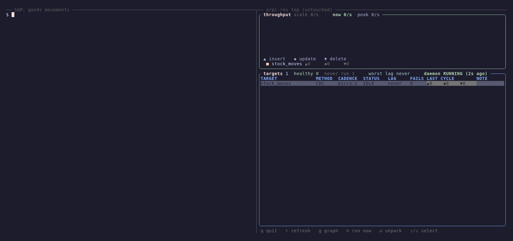

# The recorded demo



Three minutes: a million rows before, one material document in the middle, and a working
day after. An initial sync of **1,000,000 goods movements in 11 seconds**; then an
operator posts a goods receipt, transfers two items to another storage location, and an
archiving run physically removes a third, each reaching DuckDB in a second or two with
nobody running anything; then **thirty seconds of continuous mixed traffic** at a few
dozen rows a second.

The sync is followed by a count **and by ten of the rows**. A count proves a number and
nothing else: a target full of NULLs, or of one row repeated, counts exactly the same.

Re-render it:

```bash
bash demo/setup.sh          # server, target, triggers, daemon -- idempotent
vhs demo/realtime.tape      # writes demo/realtime.gif and demo/realtime.mp4
bash demo/subtitle.sh       # burns demo/subtitles.srt -> demo/realtime-subtitled.mp4
bash demo/package-html.sh   # -> demo/realtime.html, the whole thing as ONE file
bash demo/teardown.sh       # drop the triggers, purge the demo document
```

`setup.sh` is not optional between takes: it deletes the database and re-posts the
document, and a take started from a previous take's leftovers opens on a lie.

## What it shows, and how to check it

The left pane is a real SAP system. The right pane is `erpl-rev top` with the
throughput graph, started once and never touched again.

The monitor says two things at once. **Colour is the target** — one band per
replication — and **the glyph is the operation**: `▲` a row arriving, `◆` a row changed
in place, `▼` a row leaving. So the initial sync draws a block of `▲`, the transfer
draws `◆`, and the archiving run draws `▼`.

Those last two are three orders of magnitude smaller than the load, and all three are
visible on the same axis because **a bucket that did anything is never drawn as
nothing**: below the resolution of the scale it is rounded up to a single cell at the
baseline. The load keeps the axis — it is the tallest bar in the window, drawn in true
proportion, ramp and all — and the axis will come down by itself once it scrolls off the
left. Nothing is truncated to fit. Without that floor, which is how the first cut of this
worked, the graph showed the load and then nothing at all for the rest of the clip while
replication was plainly working.

The `LAST CYCLE` column carries the exact figures at the same time: `▲3` after the goods
receipt, `◆2` after the transfer, `▼1` after the archiving run — the delete visible as a
delete, on a surface that used to report all three as the single number `rows`.

It opens on the ABAP itself, in an editor with syntax highlighting, held for twenty
seconds and paged twice: the `INSERT` that posts the receipt, the `UPDATE` that
transfers two items in one unit of work, and the `DELETE` that physically removes the
third. Ordinary ABAP against an ordinary table — no API, no exit, nothing running inside
SAP — so nothing that follows has to be taken on trust.

The closing query is the point of the whole clip:

```
op  item  sap_changed  duckdb_applied  seconds_behind
I   0001  10:48:17     10:48:17                  0.85
I   0002  10:48:17     10:48:17                  0.85
I   0003  10:48:17     10:48:17                  0.85
U   0001  10:48:36     10:48:38                  2.32
U   0002  10:48:36     10:48:38                  2.32
D   0003  10:48:56     10:48:56                  0.71
```

Two independent clocks: `_commit_ts` is when SAP's trigger saw the row change,
`_applied_at` is when this engine wrote it. The gap is the answer to "how far behind is
the replica", measured rather than asserted — which is why the query is on screen
instead of a caption. `_commit_ts` carries whole seconds, so each figure is ±1s.

## And then an ordinary working day

The six single changes are followed one at a time, which proves the mechanism and says
nothing about continuous traffic. The clip closes with thirty seconds of it: new
material documents posted every second, documents from two seconds ago corrected,
documents from six seconds ago archived. **644 operations at about 21 rows a second** —
a mid-size site's goods-movement volume, not a benchmark.

The replica applies **fewer changes than that** — 547 in this take. A row inserted and
then corrected inside the same two-second cycle arrives once, already correct, and the
coalescing is work the target never has to do. How many collapse depends on where the
cycle boundaries fall, so the figure moves a little between takes; the operation counts
in SAP do not. The closing query breaks the applied changes down by operation, with the
fastest, median and slowest lag for each.

Two limits worth stating. It is **one session posting continuously**, not N concurrent
users — the load on the table and on the replica is real, the lock contention of a busy
dialog system is not. And under sustained traffic the lag grows: the single changes
land in 0.7–2.4 s, the workload's slowest in around **4.9 s**, on a laptop trial running
SAP, the engine and DuckDB at once.

## The numbers, and where they came from

| | |
|---|---|
| Initial sync | **1,000,000 rows in 11 s, ~91k rows/s, peaking at 94k** |
| Change latency | **0.7–2.4 s** single changes, **up to 4.9 s** under sustained load |
| Source | `ZSTOCK_MOVE`, 24 columns, MSEG-shaped |
| Machine | a laptop A4H trial over loopback RFC |

A million rows rather than the hundred thousand originally planned, because a hundred
thousand loads in **1.0 second** on this box — too fast to watch, and at a 2-second
sampling interval the graph would catch it in a single bucket. The row count was tuned
to the clock rather than the clock explained away.

## What it does *not* show

- **`ZSTOCK_MOVE` is a fixture shaped like MSEG**, not a real goods movement. A4H is a
  bare ABAP Platform trial with no Materials Management, so there is no MIGO posting to
  make. The shape is faithful — `MBLNR`/`MJAHR`/`ZEILE`, movement types 101/261/311,
  quantity against a unit — the provenance is not.
- **The `LAG` column is not freshness.** It is time since that target last applied
  something. On an idle target it grows, correctly. Freshness is the closing query,
  and only that.
- **The throughput graph is sampled, not instrumented.** It counts rows per refresh and
  differentiates, so it observes arrival rate; a target's first sample deliberately
  draws nothing, and colour there means *which target*, not *how high*. The glyph is
  the operation — `▲` insert, `◆` update, `▼` delete — and the three are not measured
  the same way:

  | | |
  |---|---|
  | insert | the row count, and **net within a bucket** |
  | delete | whichever sees more of them — the row count, or the cycle's own report |
  | update | the cycle's report only, because an update changes no row count |

  So an interval that inserted twenty-two rows and deleted seven draws seven deletes
  and **fifteen** inserts, not twenty-two: the insert band is a lower bound, never an
  invention. Deletes take the larger of the two signals because under traffic that also
  inserts the row count sees none at all — which is how they went missing from this
  graph entirely until the closing workload was recorded. The `LAST CYCLE` column
  carries the exact per-cycle figures.
- **A laptop trial**, not a sized system.
- **The subtitles are commentary, not evidence.** They are burned in by a separate
  ffmpeg pass and their cue times are arithmetic from the tape's `Sleep` and
  `TypingSpeed` values, so they drift the moment a beat is retimed and nobody re-runs
  `demo/subtitle.sh`. `demo/realtime.mp4` and the GIF stay unnarrated on purpose — what
  is on the terminal is the claim; the captions only point at it.

## Why the trigger tier

The target runs on trigger CDC in `KEYS_IUD`, not on a watermark, and the archiving
step is why. A **physical delete** leaves nothing behind for a reader to find later, so
a watermark is structurally blind to it; only triggers or a full snapshot see the row
leave. SAP archiving really does remove rows, which makes it the honest logistics
example rather than a contrived one.

That blindness is asserted rather than argued: `ZCL_ERPL_REV_PARITYTEST` requires a
watermark target to match a full load after inserts and updates, and to **diverge by
exactly the deleted rows** after a physical delete. If it ever stops diverging, either
the workload stopped deleting or the diff stopped comparing.

`KEYS_IUD` logs the key of a changed row and the cycle re-reads the values, keeping the
write a customer's transaction pays for narrow — measured at 14x cheaper on the write
path than logging a full row image, in [`perf-results.md`](perf-results.md).

A trigger target is not polled on a clock: it is due the moment a row appears in the
shadow table, with the cadence as a floor. `micro:2` is a ceiling on latency rather
than a polling interval.

## Defects this demo found

Building it turned up five defects that made trigger CDC unusable in production, and
every one of them was invisible to the automated tests of the day. That story, and
the tests written since so it cannot repeat, are in
[`testing.md`](testing.md#the-trigger-tier).

## The pieces

| Path | What |
|---|---|
| `demo/realtime.tape` | the vhs script — the source of truth, re-renderable |
| `demo/setup.sh` | server, registration, triggers, daemon; idempotent |
| `demo/stage.sh` | the two-pane tmux stage, and the keypress that opens the graph |
| `demo/show-abap.sh` | the lever in `nvim --clean`, so the frame carries no local config |
| `demo/subtitles.srt`, `demo/subtitle.sh` | the narration, and the ffmpeg pass that burns it |
| `demo/sample.sql` | ten rows from end to end of the million, at a prime stride |
| `demo/package-html.sh` | the recording as one self-contained HTML file, chapters and all |
| `demo/latency.sql`, `demo/items.sql` | the queries, in files because vhs cannot nest quotes |
| `demo/abap/zcl_goods_movement.abap` | the lever: post, transfer, archive |
| `demo/abap/zcl_stock_workload.abap` | thirty seconds of mixed traffic, paced to the wall clock |
| `demo/workload.sql` | what that traffic cost, per operation |
| `abap/zstock_move.ddl`, `abap/zcl_stock_move_fill.abap` | the fixture and its million rows |

The demo ABAP lives in `$TMP` and is never delivered, so the footprint gate is
unaffected.

## Sending it to someone

`demo/package-html.sh` writes **`demo/realtime.html`**: the subtitled recording embedded
as a data URI, with chapter marks, the headline figures and the honest limits, in a
single 5.5 MB file that opens offline in any browser. Attach it to a mail; there is
nothing to unpack, no player to install and no link to a host the recipient may not be
able to reach.

The chapter marks are computed from the tape's own `Sleep` and `TypingSpeed` values
rather than typed in, so they cannot drift when a beat is retimed. The file itself is
gitignored — it is 5 MB of base64 that the script regenerates in a second, and the
script is the source.

A note for anyone editing the tape: it may only contain commands that complete on their
own — `erpl-rev sql`, `erpl-rev replicate`, `erpl-rev top`, `erpl-adt object run`. Other
CLI verbs are queued into `_erpl_rev_cli_cmd` and finish only when the ABAP driver
drains them, which would hang a recording on an interval nobody controls. Those belong
in `demo/setup.sh`.
